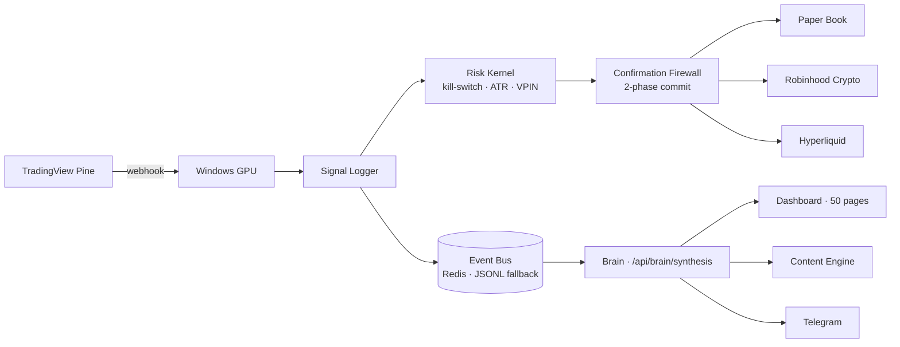

# Ari Spector · `arigatoexpress`

**Building autonomous trading systems, agentic operating systems, and intelligence platforms.**

Telegram-first. Agent-driven. Deployed on a self-owned Mac + Windows GPU + Pi mesh over Tailscale.

---

## 🏛️ Sapphire OS — flagship

> A self-sovereign operating system for capital intelligence, autonomous operations, and acquisition-grade diligence.

**[→ arigatoexpress/Sapphire](https://github.com/arigatoexpress/Sapphire)**

Bloomberg charges $24K/seat to read; Glassnode shows you charts; Datadog watches your servers. Sapphire does all three plus autonomous trading, content publishing, and a fail-closed kill switch — on hardware we own, with code you can audit.

### Proof

| Metric | Value |
|---|---|
| Passing tests | **6,735+** (6,140 unit · 595 plugin) |
| Test files | **392** |
| Plugin tools | **72** registered · 17 agent-facing |
| Dashboard pages | **50** (Flask + SSE + `/showcase` front door) |
| LaunchAgents | **27** macOS plists + Windows scheduled tasks |
| Quant strategies | **7** Python + **5** Pine v5 |
| Smart contracts | **3** Solidity (Robinhood Chain testnet, ID 46630) |
| Data feeds | **20+** market · on-chain · macro · threat · counter-party |
| Inference mesh | **4 tiers** · 28 models · RTX 5070 Ti + Pi cluster + Kimi cloud |
| Live trading | First BTC fill 2026-04-28 ($5 @ $76,774.81) · 14-day Sortino soak before $50 rung |
| Prediction accuracy | **61.1%** overall, **BTC 83.3%** (n=36 scored of 42) |

### Architecture at a glance

### What sets it apart

| | Sapphire | Bloomberg | Glassnode | Datadog |
|---|---|---|---|---|
| Cost / seat | **$0** (own hardware) | $24K/yr | $799/mo | per-host SaaS |
| Self-sovereign runtime | **✓** | ✗ | ✗ | ✗ |
| Autonomous trading + kill switch | **✓** | ✗ | ✗ | ✗ |
| On-chain analytics (24+ providers) | **✓** | ✗ | ✓ | ✗ |
| Threat intel (CISA · NVD · ATT&CK) | **✓** | ✗ | ✗ | ✗ |
| Content engine w/ 7-check rubric | **✓** | ✗ | ✗ | ✗ |
| Acquisition-grade diligence dashboard | **✓** | ✗ | ✗ | ✗ |

---

## 🛰️ Satellite repos

Sapphire is the orchestration layer. Satellites stand alone but the Brain unites them.

| Repo | Role |
|---|---|
| **[cyber-threat-bot](https://github.com/arigatoexpress/cyber-threat-bot)** | CISA KEV / NVD / MITRE aggregator — live on Cloud Run |
| **[regional-intel-workbench](https://github.com/arigatoexpress/regional-intel-workbench)** | Public-source analyst console at regional.sapphirealpha.xyz |
| **[wildfire-watch](https://github.com/arigatoexpress/wildfire-watch)** | County-scale autonomous drone fleet (Sapphire bridge merged) |
| **[Project-Go-Forward](https://github.com/arigatoexpress/Project-Go-Forward)** | THO client PM — customer/deal/doc CRM, Cloud Run deployed |
| **[tradingview-mcp](https://github.com/arigatoexpress/tradingview-mcp)** | 78-tool TradingView CDP bridge |
| **[crypto-tax-tracker](https://github.com/arigatoexpress/crypto-tax-tracker)** | Crypto tax engine |
| **[claw-code](https://github.com/arigatoexpress/claw-code)** | Rust agent runtime that hosts `claw-sapphire` plugin |
| **[kadima-bench](https://github.com/arigatoexpress/kadima-bench)** | Open-source local-LLM benchmarking for consumer GPUs |

---

## 🎯 Current focus (May 2026)

- **Hyperliquid mainnet activation** — gated on `signing_verified=True`, $5/order cap, fail-closed by default
- **Cross-chain protocol stack** — MegaETH (4326) · Arbitrum (42161) · Optimism (10) — Aave V3 + GMX V2 + Pyth oracle redundancy
- **Autonomous organization** — 6-role C-suite engine (CEO/CTO/CIO/COO/RD/CS) with compute mesh and knowledge graph
- **Hackathon submissions** — 0G APAC Hackathon (Track 2, deadline 2026-05-16) · Arbitrum London Buildathon (2026-06-14)
- **Content engine soak** — 7-cycle institutional rubric gate before publishing

---

## 🧠 Working style

Every repo has an `AGENTS.md` (or `CLAUDE.md`) with the fast path: what to read first, key paths, dev commands. Code is agent-ready — tools drop in, discipline travels.

**Stack:** Python 3.11+ · Flask · Redis · Ollama · Tailscale · GCP · Solidity · Pine Script v5 · TypeScript

**Principles:**
- PnL is king. Sortino/Calmar over Sharpe. 80%+ win-rate target.
- Fail closed at every layer — trading, security, inference, content.
- Every artifact has a verdict + provenance.
- No AI slop. Every claim verifiable from the diff or the data.

---

## 📬 Contact

- LinkedIn: [arispector](https://www.linkedin.com/in/arispector/)
- Live brain: [sapphirealpha.xyz/api/brain/synthesis](https://sapphirealpha.xyz/api/brain/synthesis)
- Public face: [sapphirealpha.xyz](https://sapphirealpha.xyz)
